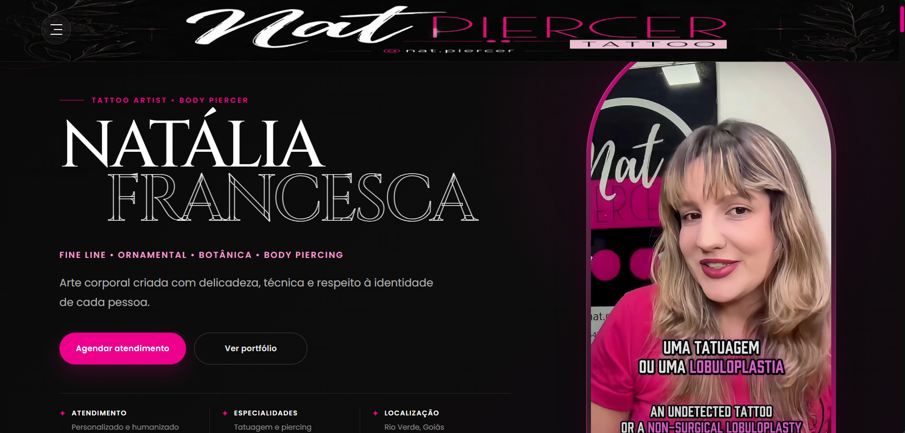
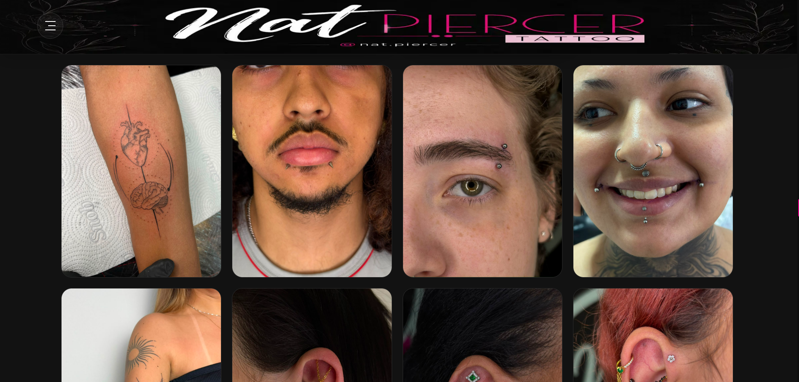
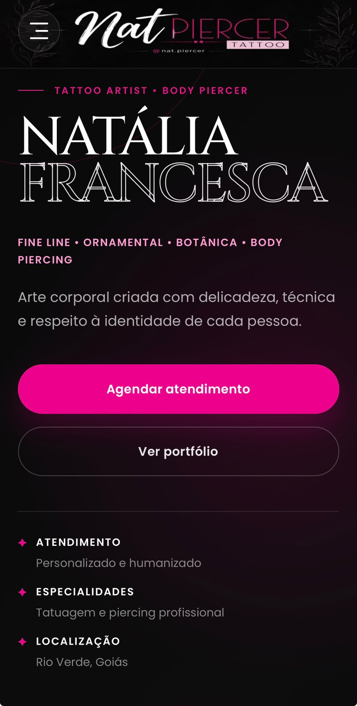
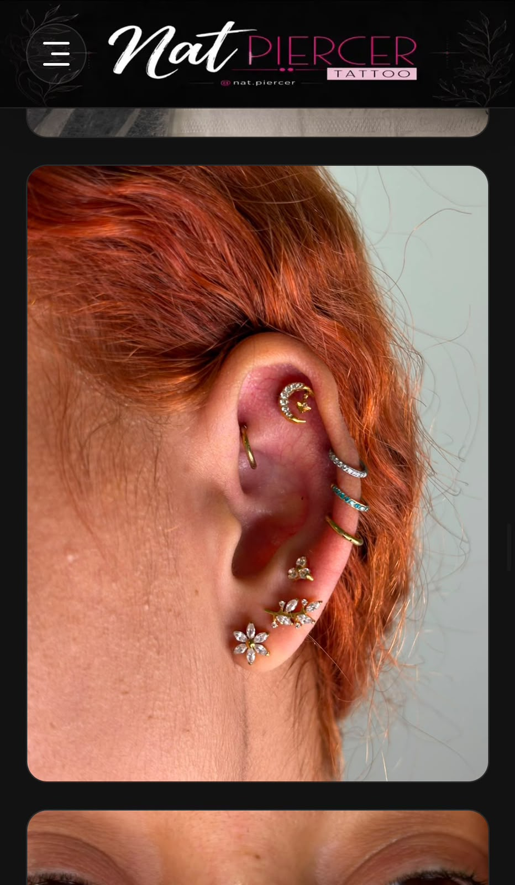

# Nat Piercer Tattoo

Portfólio profissional bilíngue desenvolvido para apresentar o trabalho de Natália Francesca, tatuadora e body piercer em Rio Verde, Goiás.

**[Visitar o site](https://natpiercertattoo.com.br/)**

## Prévia do projeto

### Computador

**Página inicial**



**Galeria de trabalhos**



### Celular

<p>
  
  
</p>

## Objetivo

Reunir a apresentação da artista, seus serviços e trabalhos em um site que facilite o contato profissional. A versão em português e inglês também permite apresentar o portfólio a públicos de diferentes países, incluindo estúdios interessados em colaborações e guest spots.

## Recursos do site

- Seleção de idioma entre português e inglês.
- Apresentação da artista, suas especialidades e serviços.
- Vídeo de apresentação na página inicial.
- Seções dedicadas ao estúdio e à galeria de trabalhos.
- Guia de piercings, certificados e avaliações.
- Seção de contato e chamadas para agendamento.
- Navegação por seções e layout responsivo.

## Tecnologias

| Tecnologia | Utilização |
| --- | --- |
| HTML | Estrutura e conteúdo das seções |
| CSS | Identidade visual e layout responsivo |
| JavaScript | Interações e seleção de idioma |
| Google Fonts | Tipografia Cinzel e Poppins |

## Estrutura do projeto

| Caminho | Conteúdo |
| --- | --- |
| `index.html` | Página principal do portfólio |
| `css/` | Estilos gerais e das seções |
| `js/` | Scripts de interação |
| `assets/` | Imagens, identidade visual e vídeos |

## Executar localmente

1. Clone o repositório:

   ```bash
   git clone https://github.com/jalkhalifa/natpiercer-tattoo.git
   cd natpiercer-tattoo
   ```

2. Inicie um servidor estático. Com Python instalado:

   ```bash
   python -m http.server 8000
   ```

   Outra opção é utilizar a extensão Live Server do VS Code.

3. Acesse `http://localhost:8000`.

O projeto utiliza HTML, CSS e JavaScript, sem etapa de compilação ou instalação de dependências com npm. O carregamento das fontes externas requer conexão com a internet.

## Organização do conteúdo

A página segue uma sequência de apresentação, serviços, estúdio, trabalhos e contato. As seções de certificados e avaliações complementam a apresentação profissional.

Textos traduzidos utilizam atributos `data-pt` e `data-en` no HTML. Ao editar um desses conteúdos, atualize as duas versões para manter a consistência entre os idiomas.

Ao substituir imagens ou vídeos, preserve os caminhos referenciados no código ou atualize as referências correspondentes.

## Autoria

Desenvolvido por **Jamila Khalifa**.

[Portfólio](https://portfolio-jamila-khalifa.netlify.app/) · [GitHub](https://github.com/jalkhalifa)

As imagens, os trabalhos artísticos e a identidade de Nat Piercer Tattoo pertencem aos seus respectivos titulares.

